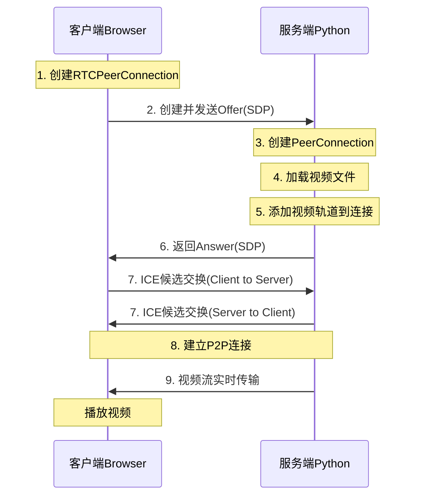

# WebRTC 视频流服务端DEMO

## DEMO概述

这是一个基于 Python 的 WebRTC 视频流服务器，可以将本地视频文件通过 WebRTC 协议实时传输到浏览器客户端。DEMO使用了 aiohttp 作为 Web 服务器框架，aiortc 作为 WebRTC 协议实现。

<!-- truncate -->

## 核心技术栈

- **包管理工具**: uv
- **后端框架**: aiohttp (异步 HTTP 服务器)
- **WebRTC 实现**: aiortc (Python WebRTC 库)
- **跨域支持**: aiohttp-cors
- **视频处理**: FFmpeg (通过 aiortc MediaPlayer)
- **运行环境**: Python 3.13+

## Demo结构

```
webrtc-server/
├── main.py                      # 服务端主程序
├── static/
│   └── index.html               # Web 客户端界面
├── assets/
│   └── Sintel.mp4              # 视频文件
├── external-client-example.html # 外部客户端示例
├── canvas-no-video.html         # Canvas 渲染示例
└── pyproject.toml              # Demo依赖配置
```

## 应用场景

### 1. 视频文件流媒体服务
- 将本地视频文件通过 WebRTC 实时传输到浏览器
- 支持视频循环播放
- 低延迟的实时视频传输

### 2. 跨域视频流服务
- 支持 CORS，可从任何网页连接
- 适合嵌入到第三方网页中
- 可作为视频 API 服务

### 3. WebRTC 技术演示
- 教学示例，展示 WebRTC 基本工作原理
- SDP 协商过程演示
- 点对点连接建立演示

---

## 完整代码实现

### 1. 服务端代码 (main.py)

```python
import asyncio
import json
import logging
import os
from pathlib import Path

from aiohttp import web
from aiortc import RTCPeerConnection, RTCSessionDescription
from aiortc.contrib.media import MediaPlayer
import aiohttp_cors

# 获取Demo根目录
ROOT = Path(__file__).parent
# 配置日志
logging.basicConfig(level=logging.INFO)
logger = logging.getLogger(__name__)

# 存储所有活跃的 PeerConnection
pcs = set()


async def index(request):
    """
    返回 HTML 客户端页面
    """
    content = open(ROOT / "static" / "index.html", "r").read()
    return web.Response(content_type="text/html", text=content)


async def offer(request):
    """
    处理来自客户端的 WebRTC Offer 请求
    """
    # 1. 接收客户端发送的 SDP Offer
    sdp_text = await request.text()
    offer = RTCSessionDescription(sdp=sdp_text, type="offer")

    # 2. 创建 RTCPeerConnection 对象
    pc = RTCPeerConnection()
    pcs.add(pc)

    # 3. 监听连接状态变化
    # @pc.on("connectionstatechange") 等价于 pc.on("connectionstatechange")(on_connectionstatechange)
    async def on_connectionstatechange():
        logger.info(f"连接状态: {pc.connectionState}")
        if pc.connectionState == "failed" or pc.connectionState == "closed":
            await pc.close()
            pcs.discard(pc)

    pc.on("connectionstatechange")(on_connectionstatechange)

    # 4. 检查视频文件是否存在
    video_path = str(ROOT / "assets" / "Sintel.mp4")
    if not os.path.exists(video_path):
        logger.error(f"视频文件未找到: {video_path}")
        return web.Response(
            content_type="application/json",
            text=json.dumps({"error": "Video file not found"}),
            status=500,
        )

    # 5. 使用 MediaPlayer 加载视频文件
    logger.info(f"正在加载视频: {video_path}")
    player = MediaPlayer(video_path, options={"loop": "1"})

    # 6. 将视频轨道添加到 PeerConnection
    if player.video:
        pc.addTrack(player.video)
        logger.info("视频轨道已添加到 PeerConnection")
    else:
        logger.error("MediaPlayer 无法获取视频轨道")
        return web.Response(
            content_type="application/json",
            text=json.dumps({"error": "Failed to load video track"}),
            status=500,
        )

    # 7. 设置远程描述并创建应答
    await pc.setRemoteDescription(offer)
    answer = await pc.createAnswer()
    await pc.setLocalDescription(answer)

    # 8. 返回 SDP Answer
    return web.Response(
        content_type="application/sdp",
        text=pc.localDescription.sdp,
    )


async def on_shutdown(app):
    """
    服务器关闭时清理所有 PeerConnection
    """
    coros = [pc.close() for pc in pcs]
    await asyncio.gather(*coros)
    pcs.clear()


def main():
    # 创建 aiohttp 应用
    app = web.Application()
    app.on_shutdown.append(on_shutdown)

    # 配置 CORS，允许来自任何源的请求
    cors = aiohttp_cors.setup(app, defaults={
        "*": aiohttp_cors.ResourceOptions(
            allow_credentials=True,
            expose_headers="*",
            allow_headers="*",
            allow_methods="*"
        )
    })

    # 添加路由
    index_route = app.router.add_get("/", index)
    offer_route = app.router.add_post("/offer", offer)
    app.router.add_static("/static", ROOT / "static")

    # 为路由启用 CORS
    cors.add(index_route)
    cors.add(offer_route)

    logger.info("WebRTC 服务器启动: http://localhost:8000")
    logger.info("CORS 已启用 - 接受来自任何源的请求")
    web.run_app(app, host="0.0.0.0", port=8000)


if __name__ == "__main__":
    main()
```

### 2. 客户端代码 (static/index.html)

```html
<!DOCTYPE html>
<html lang="zh-CN">
<head>
    <meta charset="UTF-8">
    <meta name="viewport" content="width=device-width, initial-scale=1.0">
    <title>WebRTC 视频流演示</title>
    <style>
        * {
            margin: 0;
            padding: 0;
            box-sizing: border-box;
        }

        body {
            font-family: -apple-system, BlinkMacSystemFont, 'Segoe UI', Roboto, Oxygen, Ubuntu, Cantarell, sans-serif;
            background: linear-gradient(135deg, #667eea 0%, #764ba2 100%);
            min-height: 100vh;
            display: flex;
            justify-content: center;
            align-items: center;
            padding: 20px;
        }

        .container {
            background: white;
            border-radius: 12px;
            box-shadow: 0 20px 60px rgba(0, 0, 0, 0.3);
            padding: 40px;
            max-width: 900px;
            width: 100%;
        }

        h1 {
            color: #333;
            margin-bottom: 10px;
            font-size: 28px;
        }

        .subtitle {
            color: #666;
            margin-bottom: 30px;
            font-size: 14px;
        }

        .video-container {
            position: relative;
            background: #000;
            border-radius: 8px;
            overflow: hidden;
            margin-bottom: 20px;
            aspect-ratio: 16 / 9;
        }

        video {
            width: 100%;
            height: 100%;
            object-fit: contain;
        }

        .controls {
            display: flex;
            gap: 10px;
            margin-bottom: 20px;
        }

        button {
            flex: 1;
            padding: 12px 24px;
            border: none;
            border-radius: 6px;
            font-size: 16px;
            font-weight: 600;
            cursor: pointer;
            transition: all 0.3s ease;
        }

        button:disabled {
            opacity: 0.5;
            cursor: not-allowed;
        }

        #startBtn {
            background: linear-gradient(135deg, #667eea 0%, #764ba2 100%);
            color: white;
        }

        #startBtn:hover:not(:disabled) {
            transform: translateY(-2px);
            box-shadow: 0 5px 15px rgba(102, 126, 234, 0.4);
        }

        #stopBtn {
            background: #ef4444;
            color: white;
        }

        #stopBtn:hover:not(:disabled) {
            transform: translateY(-2px);
            box-shadow: 0 5px 15px rgba(239, 68, 68, 0.4);
        }

        .status {
            padding: 12px 20px;
            border-radius: 6px;
            margin-bottom: 20px;
            font-size: 14px;
            font-weight: 500;
        }

        .status.info {
            background: #dbeafe;
            color: #1e40af;
        }

        .status.success {
            background: #dcfce7;
            color: #166534;
        }

        .status.error {
            background: #fee2e2;
            color: #991b1b;
        }

        .info-box {
            background: #f9fafb;
            border-left: 4px solid #667eea;
            padding: 15px 20px;
            border-radius: 6px;
            font-size: 14px;
            color: #555;
        }

        .info-box strong {
            color: #333;
            display: block;
            margin-bottom: 5px;
        }
    </style>
</head>
<body>
    <div class="container">
        <h1>WebRTC 视频流演示</h1>
        <p class="subtitle">使用 WebRTC 从服务器流式传输视频</p>

        <div class="video-container">
            <video id="videoElement" autoplay playsinline></video>
        </div>

        <div class="controls">
            <button id="startBtn">开始流媒体</button>
            <button id="stopBtn" disabled>停止流媒体</button>
        </div>

        <div id="status" class="status info">准备连接。点击"开始流媒体"开始。</div>

        <div class="info-box">
            <strong>关于此演示：</strong>
            此演示使用 WebRTC 技术从服务器流式传输视频。服务器读取视频文件 (Sintel.mp4)，
            并使用点对点连接实时传输到您的浏览器。
        </div>
    </div>

    <script>
        // 获取页面元素
        const startBtn = document.getElementById('startBtn');
        const stopBtn = document.getElementById('stopBtn');
        const videoElement = document.getElementById('videoElement');
        const statusDiv = document.getElementById('status');

        // PeerConnection 对象
        let pc = null;

        // 更新状态显示
        function updateStatus(message, type = 'info') {
            statusDiv.textContent = message;
            statusDiv.className = `status ${type}`;
        }

        // 开始视频流
        async function startStreaming() {
            try {
                // 1. 创建 RTCPeerConnection
                updateStatus('正在创建对等连接...', 'info');
                pc = new RTCPeerConnection({
                    iceServers: [{ urls: 'stun:stun.l.google.com:19302' }]
                });

                // 2. 监听视频轨道
                pc.ontrack = (event) => {
                    updateStatus('正在接收视频流...', 'success');
                    videoElement.srcObject = event.streams[0];
                };

                // 3. 监听 ICE 连接状态变化
                pc.oniceconnectionstatechange = () => {
                    console.log('ICE 连接状态:', pc.iceConnectionState);
                    if (pc.iceConnectionState === 'connected') {
                        updateStatus('已连接！正在播放视频...', 'success');
                    } else if (pc.iceConnectionState === 'disconnected' || pc.iceConnectionState === 'failed') {
                        updateStatus('连接丢失，请重试', 'error');
                        stopStreaming();
                    }
                };

                // 4. 添加视频接收器（仅接收，不发送）
                pc.addTransceiver('video', { direction: 'recvonly' });

                // 5. 创建 Offer
                updateStatus('正在创建 Offer...', 'info');
                const offer = await pc.createOffer();
                await pc.setLocalDescription(offer);

                // 6. 发送 Offer 到服务器
                updateStatus('正在发送 Offer 到服务器...', 'info');
                const response = await fetch('/offer', {
                    method: 'POST',
                    headers: { 'Content-Type': 'application/sdp' },
                    body: pc.localDescription.sdp
                });

                if (!response.ok) {
                    throw new Error('服务器错误: ' + response.statusText);
                }

                const sdpText = await response.text();

                // 7. 设置服务器返回的 Answer
                updateStatus('收到 Answer，正在建立连接...', 'info');
                await pc.setRemoteDescription(new RTCSessionDescription({
                    type: 'answer',
                    sdp: sdpText
                }));

                // 8. 更新按钮状态
                startBtn.disabled = true;
                stopBtn.disabled = false;

            } catch (error) {
                console.error('错误:', error);
                updateStatus('错误: ' + error.message, 'error');
                stopStreaming();
            }
        }

        // 停止视频流
        function stopStreaming() {
            if (pc) {
                pc.close();
                pc = null;
            }
            videoElement.srcObject = null;
            startBtn.disabled = false;
            stopBtn.disabled = true;
            updateStatus('流已停止。点击"开始流媒体"重新连接。', 'info');
        }

        // 绑定按钮事件
        startBtn.addEventListener('click', startStreaming);
        stopBtn.addEventListener('click', stopStreaming);
    </script>
</body>
</html>
```

### 3. 外部客户端示例 (external-client-example.html)

```html
<!DOCTYPE html>
<html lang="zh-CN">
<head>
    <meta charset="UTF-8">
    <meta name="viewport" content="width=device-width, initial-scale=1.0">
    <title>外部 WebRTC 客户端示例</title>
    <style>
        body {
            font-family: Arial, sans-serif;
            max-width: 800px;
            margin: 50px auto;
            padding: 20px;
        }
        video {
            width: 100%;
            max-width: 640px;
            background: #000;
            border-radius: 8px;
        }
        button {
            padding: 10px 20px;
            margin: 10px 5px;
            font-size: 16px;
            cursor: pointer;
        }
        #status {
            padding: 10px;
            margin: 10px 0;
            border-radius: 4px;
            background: #f0f0f0;
        }
        .error { background: #ffcccc !important; color: #cc0000; }
        .success { background: #ccffcc !important; color: #006600; }
    </style>
</head>
<body>
    <h1>外部 WebRTC 客户端示例</h1>
    <p>此页面演示如何从任何外部 HTML 页面连接到 WebRTC 服务器。</p>

    <div>
        <label>服务器 URL: <input type="text" id="serverUrl" value="http://localhost:8000" style="width: 300px;"></label>
    </div>

    <div>
        <button onclick="startStream()">开始流媒体</button>
        <button onclick="stopStream()">停止流媒体</button>
    </div>

    <div id="status">状态: 就绪</div>

    <video id="video" autoplay playsinline></video>

    <h2>使用说明：</h2>
    <ol>
        <li>确保 WebRTC 服务器正在运行: <code>uv run python main.py</code></li>
        <li>如果需要，更新服务器 URL（默认: http://localhost:8000）</li>
        <li>点击"开始流媒体"开始接收视频</li>
        <li>此页面可以从任何地方提供服务 - 甚至可以作为 file:// URL 打开</li>
    </ol>

    <h2>代码示例：</h2>
    <pre style="background: #f5f5f5; padding: 15px; border-radius: 5px; overflow-x: auto;">
const pc = new RTCPeerConnection();

pc.ontrack = (event) => {
    videoElement.srcObject = event.streams[0];
};

pc.addTransceiver('video', { direction: 'recvonly' });

const offer = await pc.createOffer();
await pc.setLocalDescription(offer);

const response = await fetch('http://localhost:8000/offer', {
    method: 'POST',
    headers: { 'Content-Type': 'application/sdp' },
    body: pc.localDescription.sdp
});

const sdpText = await response.text();
await pc.setRemoteDescription(new RTCSessionDescription({
    type: 'answer',
    sdp: sdpText
}));
    </pre>

    <script>
        // PeerConnection 对象
        let pc = null;
        const video = document.getElementById('video');
        const status = document.getElementById('status');
        const serverUrlInput = document.getElementById('serverUrl');

        // 更新状态显示
        function updateStatus(message, type = 'normal') {
            status.textContent = '状态: ' + message;
            status.className = type;
            console.log(message);
        }

        // 开始视频流
        async function startStream() {
            try {
                // 获取服务器 URL
                const serverUrl = serverUrlInput.value.trim();
                if (!serverUrl) {
                    updateStatus('请输入服务器 URL', 'error');
                    return;
                }

                updateStatus('正在创建对等连接...', 'normal');

                // 创建 RTCPeerConnection
                pc = new RTCPeerConnection({
                    iceServers: [{ urls: 'stun:stun.l.google.com:19302' }]
                });

                // 监听视频轨道
                pc.ontrack = (event) => {
                    updateStatus('正在接收视频流！', 'success');
                    video.srcObject = event.streams[0];
                };

                // 监听 ICE 连接状态
                pc.oniceconnectionstatechange = () => {
                    console.log('ICE 连接状态:', pc.iceConnectionState);
                    if (pc.iceConnectionState === 'connected') {
                        updateStatus('已连接！正在播放视频...', 'success');
                    } else if (pc.iceConnectionState === 'disconnected' || pc.iceConnectionState === 'failed') {
                        updateStatus('连接丢失: ' + pc.iceConnectionState, 'error');
                    }
                };

                // 添加视频接收器
                pc.addTransceiver('video', { direction: 'recvonly' });

                // 创建 Offer
                updateStatus('正在创建 Offer...', 'normal');
                const offer = await pc.createOffer();
                await pc.setLocalDescription(offer);

                // 发送 Offer 到服务器
                updateStatus('正在发送 Offer 到 ' + serverUrl + '/offer...', 'normal');

                const response = await fetch(serverUrl + '/offer', {
                    method: 'POST',
                    headers: { 'Content-Type': 'application/sdp' },
                    body: pc.localDescription.sdp
                });

                if (!response.ok) {
                    throw new Error(`HTTP ${response.status}: ${response.statusText}`);
                }

                const sdpText = await response.text();

                // 设置远程描述
                updateStatus('正在设置远程描述...', 'normal');
                await pc.setRemoteDescription(new RTCSessionDescription({
                    type: 'answer',
                    sdp: sdpText
                }));

                updateStatus('等待连接...', 'normal');

            } catch (error) {
                console.error('错误:', error);
                updateStatus('错误: ' + error.message, 'error');
                stopStream();
            }
        }

        // 停止视频流
        function stopStream() {
            if (pc) {
                pc.close();
                pc = null;
            }
            video.srcObject = null;
            updateStatus('流已停止', 'normal');
        }
    </script>
</body>
</html>
```

### 4. Demo配置 (pyproject.toml)

```toml
[project]
name = "webrtc-server"
version = "0.1.0"
description = "WebRTC server demo for streaming video files"
readme = "README.md"
requires-python = ">=3.13"
dependencies = [
    "aiohttp>=3.9.0",
    "aiortc>=1.6.0",
    "aiohttp-cors>=0.7.0",
]
```

---

## 工作原理详解

### WebRTC 信令流程



### 核心组件说明

#### 1. RTCPeerConnection
- 负责建立和管理 WebRTC 点对点连接
- 处理 ICE 候选交换
- 管理媒体流的发送和接收

#### 2. MediaPlayer (aiortc)
- 封装 FFmpeg，用于读取和解码视频文件
- 提供视频帧流供 WebRTC 传输
- 支持循环播放选项

#### 3. SDP (Session Description Protocol)
- Offer: 客户端发起的会话描述
- Answer: 服务端响应的会话描述
- 包含媒体格式、编解码器、网络信息等

#### 4. ICE (Interactive Connectivity Establishment)
- 用于 NAT 穿透
- STUN 服务器帮助发现公网 IP
- 确保客户端和服务端能建立连接

---

## 安装与运行

### 1. 安装依赖

使用 uv:
```bash
uv sync
```

或使用 pip:
```bash
uv add aiohttp aiortc aiohttp-cors
```

### 2. 准备视频文件

将视频文件放置在 `assets/Sintel.mp4`，或修改代码中的路径。

### 3. 启动服务器

或使用 uv:
```bash
uv run python main.py
```

### 4. 访问客户端

打开浏览器访问:
```
http://localhost:8000
```

---

## API 接口说明

### GET /
返回主页面 HTML 客户端界面

### POST /offer
处理 WebRTC Offer 请求

**请求:**
- Content-Type: `application/sdp`
- Body: SDP Offer 文本

**响应:**
- Content-Type: `application/sdp`
- Body: SDP Answer 文本

**错误响应:**
```json
{
  "error": "Video file not found"
}
```

---

## 关键代码解析

### 服务端核心逻辑

```python
# 1. 接收客户端 Offer
sdp_text = await request.text()
offer = RTCSessionDescription(sdp=sdp_text, type="offer")

# 2. 创建 PeerConnection
pc = RTCPeerConnection()

# 3. 加载视频文件并添加到轨道
player = MediaPlayer(video_path, options={"loop": "1"})
pc.addTrack(player.video)

# 4. 设置远程描述并创建应答
await pc.setRemoteDescription(offer)
answer = await pc.createAnswer()
await pc.setLocalDescription(answer)

# 5. 返回 Answer 给客户端
return web.Response(
    content_type="application/sdp",
    text=pc.localDescription.sdp,
)
```

### 客户端核心逻辑

```javascript
// 1. 创建 PeerConnection 对象
const pc = new RTCPeerConnection({
    iceServers: [{ urls: 'stun:stun.l.google.com:19302' }]  // 使用 Google STUN 服务器
});

// 2. 监听视频轨道事件
pc.ontrack = (event) => {
    videoElement.srcObject = event.streams[0];  // 将接收到的视频流绑定到 video 元素
};

// 3. 添加视频接收器（仅接收，不发送）
pc.addTransceiver('video', { direction: 'recvonly' });

// 4. 创建 Offer
const offer = await pc.createOffer();
await pc.setLocalDescription(offer);

// 5. 发送 Offer 到服务器
const response = await fetch('/offer', {
    method: 'POST',
    headers: { 'Content-Type': 'application/sdp' },
    body: pc.localDescription.sdp
});

// 6. 接收并设置服务器返回的 Answer
const sdpText = await response.text();
await pc.setRemoteDescription(new RTCSessionDescription({
    type: 'answer',
    sdp: sdpText
}));
```

---

## 扩展应用场景

### 1. 监控视频流
- 将摄像头或监控设备视频通过 WebRTC 推送到浏览器
- 实现远程监控功能

### 2. 直播服务
- 替换 MediaPlayer 为实时视频源
- 实现低延迟直播

### 3. 视频会议
- 添加双向视频流支持
- 实现多人视频通话

### 4. 屏幕共享
- 使用屏幕捕获作为视频源
- 实现远程演示功能

---

## 常见问题

### 1. 视频文件不存在
确保 `assets/Sintel.mp4` 文件存在，或修改代码中的路径。

### 2. 连接失败
- 检查防火墙设置
- 确保端口 8000 可用
- 检查 STUN 服务器是否可访问

### 3. 浏览器兼容性
支持的浏览器:
- Chrome/Edge (推荐)
- Firefox
- Safari (macOS/iOS)

### 4. CORS 错误
服务器已配置 CORS 支持，允许所有来源访问。

---

## 性能优化建议

1. **视频编码**: 使用 H.264 编码的视频文件以获得最佳兼容性
2. **比特率控制**: 根据网络状况调整视频比特率
3. **连接池管理**: 限制最大并发连接数
4. **资源清理**: 及时关闭断开的连接，释放资源

---

## 总结

这个DEMO展示了如何使用 Python 和 aiortc 库构建一个完整的 WebRTC 视频流服务器。通过 WebRTC 协议，可以实现低延迟、高质量的实时视频传输。Demo代码简洁清晰，适合作为学习 WebRTC 技术的入门示例。

核心特点:
- ✅ 完整的 WebRTC 实现
- ✅ 支持跨域访问
- ✅ 优雅的错误处理
- ✅ 资源自动清理
- ✅ 响应式 Web 界面
- ✅ 详细的日志输出
